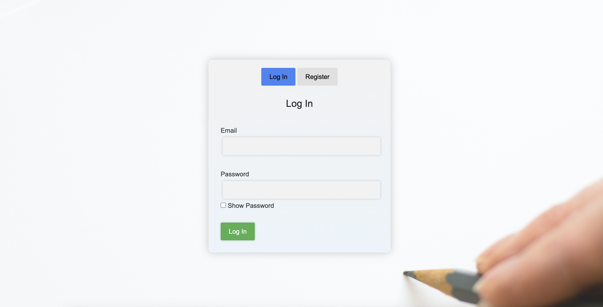
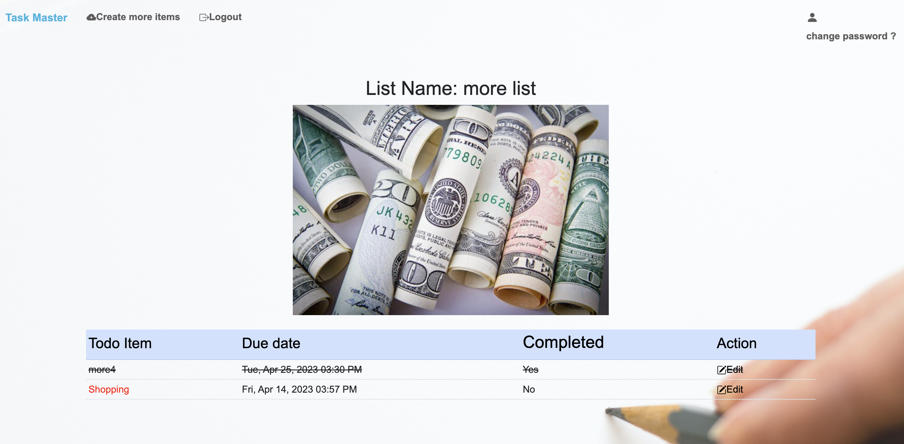
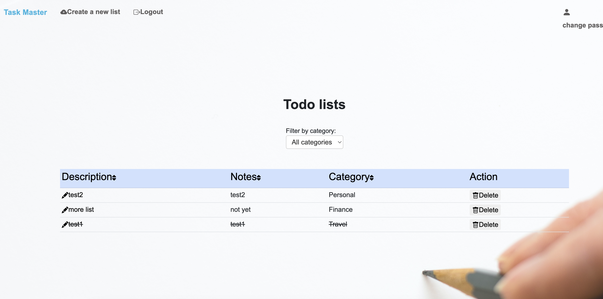

# Task Master

## Summary

Task Master is a web application that helps users track and manage their daily tasks and to-do lists. It allows users to create and categorize their tasks, set due dates and reminders, and also provides the feature of selecting a photo based on the selected category through the Pexels API. Additionally, users can edit or delete their to-do lists. The goal of this project is to create a simple yet powerful task management tool that helps users stay organized and focused on their daily tasks.

## Features
Login Page:
Login (with show password feature) or register to create a todo list.

Create List:
create a new list and select the category. When the user clicks on a certain category, an image will show up (using the Pexels API to retrieve relevant photos).

To-list Detail:
Add a strikethrough to a completed todo item and allow editing of todo items. If the due date is less than two days away or past due , change the text to red.

All-List:
delete the list, fitering, sorting

## About the Developer

Task Master was created by Lin Wang, a software engineer in New York, NY. Learn more about the developer on [LinkedIn](https://www.linkedin.com/in/linwang96).

## Technologies

Tech Stack:

- Python
- Flask
- SQLAlchemy
- PostgreSQL
- Jinja2
- HTML
- CSS
- Javascript
- AJAX
- Bootstrap
- Python unittest module
- Pexels API

Task Master is an app built on a Flask server with a PostgreSQL database and with SQLAlchemy as the ORM. The front end templating uses Jinja2, the HTML was built using Bootstrap, and the Javascript AJAX to interact with the backend.
